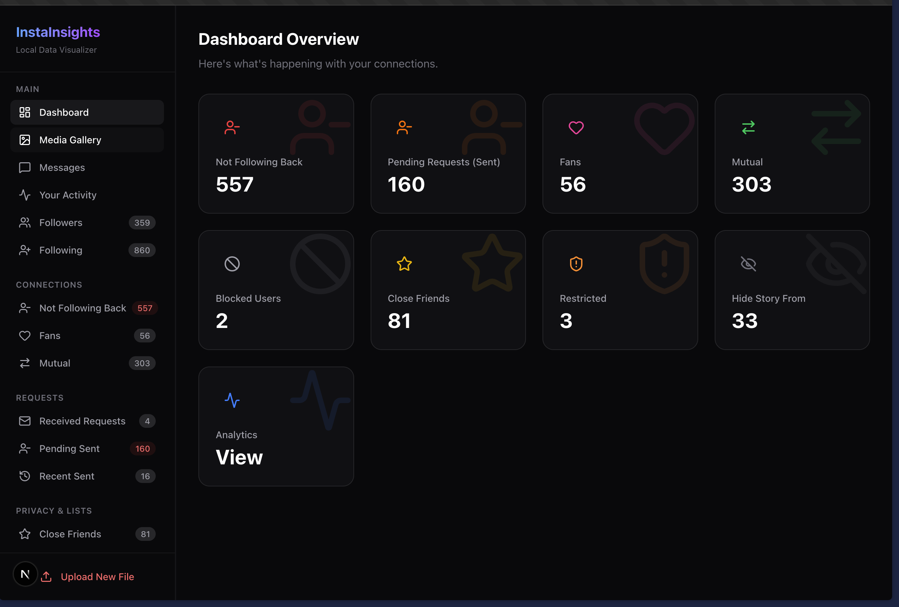

# Insta Backup Viewer

**Insta Backup Viewer** is a privacy-focused, local-first tool that lets you explore and visualize your Instagram data export. View your followers, comments, likes, photos, videos, and chat history in a beautiful, dark-mode dashboard—without ever uploading your data to the cloud.



## Features

- **Connections Analyzer**: see who isn't following you back, your fans, and mutual connections.
- **Media Gallery**: Browse your photos, videos, stories, and reels in a rich grid layout or slideshow.
- **Chat Viewer**: Read your entire DM history with a familiar interface, including photos and videos sent in chat.
- **Activity Log**: Search through your comment history and liked posts.
- **Privacy First**: All data remains on your machine. Nothing is uploaded.

## How to Get Your Instagram Backup

To use this tool, you need to request your data from Instagram.

1.  **Open Instagram App (Mobile)**:
    - Go to your profile -> Menu (3 lines) -> **Your Activity**.
    - Scroll down to **Download your information**.
    - Tap **Request a download**.
    - Select **Complete copy** (recommended) or specific types (Followers, Messages, Content, Likes, Comments).
    - **Format**: Select **JSON** (Required).
    - **Media Quality**: High (recommended).
    - **Date Range**: All time.
    - Tap **Submit Request**.

2.  **Open Instagram (Web)**:
    - Go to `Settings` -> `Your Activity` -> `Download your information`.
    - Follow the same steps as above, ensuring format is **JSON**.

3.  **Wait & Download**:
    - Instagram will email you when the download is ready (it can take hours).
    - Download the zip file(s).
    - **Unzip** the file. You should see a folder structure like this:
      ```
      instagram-username-202X-XX-XX/
      ├── connections/
      ├── your_instagram_activity/
      │   ├── messages/
      │   ├── content/
      │   ├── ...
      ├── media/
      │   ├── posts/
      │   ├── stories/
      │   ├── ...
      ```

## How to Run This Tool

1.  **Clone the Repository**:

    ```bash
    git clone https://github.com/yourusername/insta-backup-viewer.git
    cd insta-backup-viewer
    ```

2.  **Install Dependencies**:

    ```bash
    npm install
    ```

3.  **Start the App**:

    ```bash
    npm run dev
    ```

4.  **Open in Browser**:
    - Go to `http://localhost:3000`.
    - Click the **Upload/Select** button in the sidebar.
    - Select the **root folder** of your unzipped Instagram data.
    - The app will parse your data and display the dashboard.

## Tech Stack

- **Next.js 14**: App Router, Server Actions.
- **SQLite**: Local database for fast querying and persistence.
- **TailwindCSS**: Styling.
- **Framer Motion**: Animations.

## License

MIT
